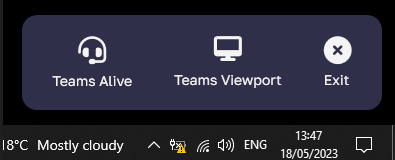

# Teams Tools 🛠

  

A small utility app for Windows that extends the functionality of MS Teams.

 (Not an official MS project).

## Teams Viewport

Did you buy a fancy ultra widescreen monitor, maybe you have a resolution like 5120x1440? When sharing your screen your friends and colleagues are unable to view your content as it will be to small / condensed. While allows you to share a single window it doesn't allow you to share an area of the screen. This is not a workable solution when wishing to share multiple apps. Teams Tools allows you to select an area of the screen to share with 'Teams Viewport' and even allows you to move and resize that area while sharing. Simply launch team viewport and then select that as the shared window in teams!

## Teams Alive

Use Teams tools to take back control of your teams availability status with 'Teams Alive'! When using MS teams your status is unreliable as it will automatically be set to away after a given time without user input and does not provide a way to disable automatic away status. Activating keep alive enforces the status you set in the teams user interface.

## Teams Tools UI

The UI of Teams Tools is small, clean and unobtrusive.

